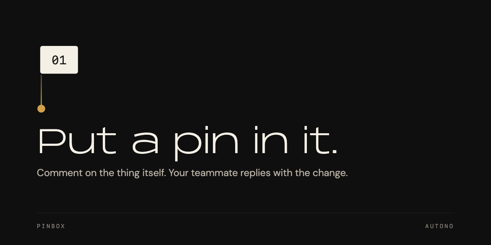

<p align="center">
  
</p>

# pinbox

Drop a pin on a live app, and the coding agent already working on it picks the pin up, fixes the code, replies on the thread, and resolves it.

[](https://github.com/autonoco/pinbox/actions/workflows/validate.yml)
[](LICENSE)

## Install

Building from source is the only route that works today — nothing is on npm and no
release is tagged yet. You need [Bun](https://bun.sh) 1.3 or newer to build, not to run.

```sh
git clone https://github.com/autonoco/pinbox.git
cd pinbox
bun install
bun run build
export PATH="$PWD/packages/cli/dist:$PATH"
```

```console
$ pinbox --version
0.1.0
```

The binary at `packages/cli/dist/pinbox` is self-contained — Bun is compiled into it — so
you can copy it anywhere on your `PATH`. Prebuilt binaries on GitHub Releases and an
`@autono/pinbox` npm launcher are both wired up and will work as soon as the first release
is tagged; see [`docs/installation.mdx`](docs/installation.mdx).

## Use it

**1. Set up the project you want feedback on.** This creates `.pinbox/`, gitignores it,
installs the pinbox skill for every coding agent it finds, and adds a `post-commit` hook.

```console
$ pinbox init --yes
ok  .pinbox     created
ok  .gitignore  created (.pinbox/ entry)
ok  claude      installed .claude/skills/pinbox (skills-dir)
ok  git-hook    installed .git/hooks/post-commit
```

**2. Pin what is wrong.** Anchor it to a web surface with `--url` and `--selector`, or to
a source location with `--file src/checkout.ts:42`.

```console
$ pinbox pin "Pay button is cut off on mobile" \
    --url http://localhost:5173/checkout --selector "button.pay"
pin_6qe8guhf57
pinned to http://localhost:5173/checkout
```

**3. See what is open.** `list` for the queue, `show` for one pin and its thread.

```console
$ pinbox list
pin_6qe8guhf57  open  just now  button.pay  Pay button is cut off on mobile
1 pin (1 open)

$ pinbox show pin_6qe8guhf57
pin_6qe8guhf57  open  note
text      Pay button is cut off on mobile
target    button.pay
url       http://localhost:5173/checkout
git       main @ fd4b67b
author    ada@example.com
created   2026-08-06T21:15:28.526Z (just now)
```

The branch and commit were captured for you. That is the point of a pin over a sentence in
chat: the agent never has to ask where you were.

**4. Reply on the thread.** Replying adds a message and never changes the status, so an
agent can report progress or ask a question without closing anything.

```console
$ pinbox reply pin_6qe8guhf57 "Bumped the min-width — re-check at 320px?" --as agent
msg_8e3gw0nnxf
replied to pin_6qe8guhf57 as agent
```

**5. Resolve it** — with a note saying what changed, or why it will not.

```console
$ pinbox resolve pin_6qe8guhf57 --note "min-width: 8rem on .pay" --as agent
pin_6qe8guhf57 resolved
by agent — min-width: 8rem on .pay
```

Or name the pin in a commit message and the hook does it for you, with the commit
attached. `Fixes`, `Resolves`, and `Closes` all work.

```sh
git commit -m "Widen the pay button

Fixes pin_6qe8guhf57"
```

Two things you never had to do: start a server — the first command that needs the hub
starts it, and it exits when idle — and learn a second interface. Pipe any command to
another program and you get JSON instead of text, so an agent runs exactly what you just
ran.

## Why a pin

You are clicking through your app and something is wrong. Now you have to describe it
somewhere else: which page, which element, which branch you were on, what you expected. By
the time an agent has enough to work with, you have retyped everything you were already
looking at, and the answer comes back somewhere the report is not.

Pinbox closes that round trip. A pin captures your words plus the context — URL, selector,
file and line, branch and commit — and it stays a conversation until someone resolves it.

## How it works

Pins live in a SQLite file in your project (`.pinbox/pinbox.db`), served by a local hub
daemon bound to `127.0.0.1`. Nothing leaves your machine unless you link a pin to a
tracker. Every verb is a command with a `--json` mode and a documented exit code, which is
the whole API — an agent drives pinbox the same way you do, and `pinbox init` gives it the
skill so it knows these verbs without being told.

## Documentation

Docs live in [`docs/`](docs/index.mdx) and are built with Mintlify.

- [Quickstart](docs/quickstart.mdx) — the whole loop in one terminal session
- [Installation](docs/installation.mdx) — every route, and how to verify it
- [CLI reference](docs/cli/commands/overview.mdx) — every command, flag, exit code, JSON shape
- [Concepts](docs/concepts/pins.mdx) — pins, threads, sessions, the hub, where data lives
- [Toolbar](docs/integrations/toolbar.mdx) — drop pins from the browser instead

## Layout

```
packages/core       @autono/pinbox-core — schema, hub handler, stores, connectors
packages/toolbar    @autono/pinbox-toolbar — zero-dependency web component + wrappers
packages/cli        the `pinbox` binary — commands, daemon lifecycle, init
packages/mcp        @autono/pinbox-mcp — stdio MCP server over the core client
skills/pinbox       the agent skill (generated from the CLI command tree)
plugins/            agent-host plugin packages (generated)
integrations/       agent-host integrations (generated)
examples/           script-tag, vite-react, and a deployable Cloudflare Worker
e2e/                cross-package tests, plus the Workers suite on real workerd
tools/              release pipeline, generators, validation scripts
docs/               this documentation site
```

## Contributing

Issues and pull requests are welcome. [Bun](https://bun.sh) 1.3+ is the runtime, the test
runner, and the script runner; read [`docs/contributing.mdx`](docs/contributing.mdx) before
you open a PR.

```sh
bun install
bun test
bun run ci:validate
```

## License

MIT © Autono Holdings Inc. See [LICENSE](LICENSE).
